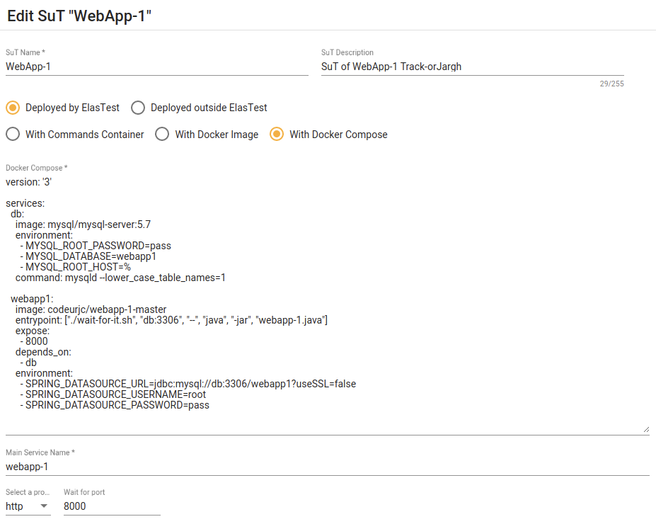
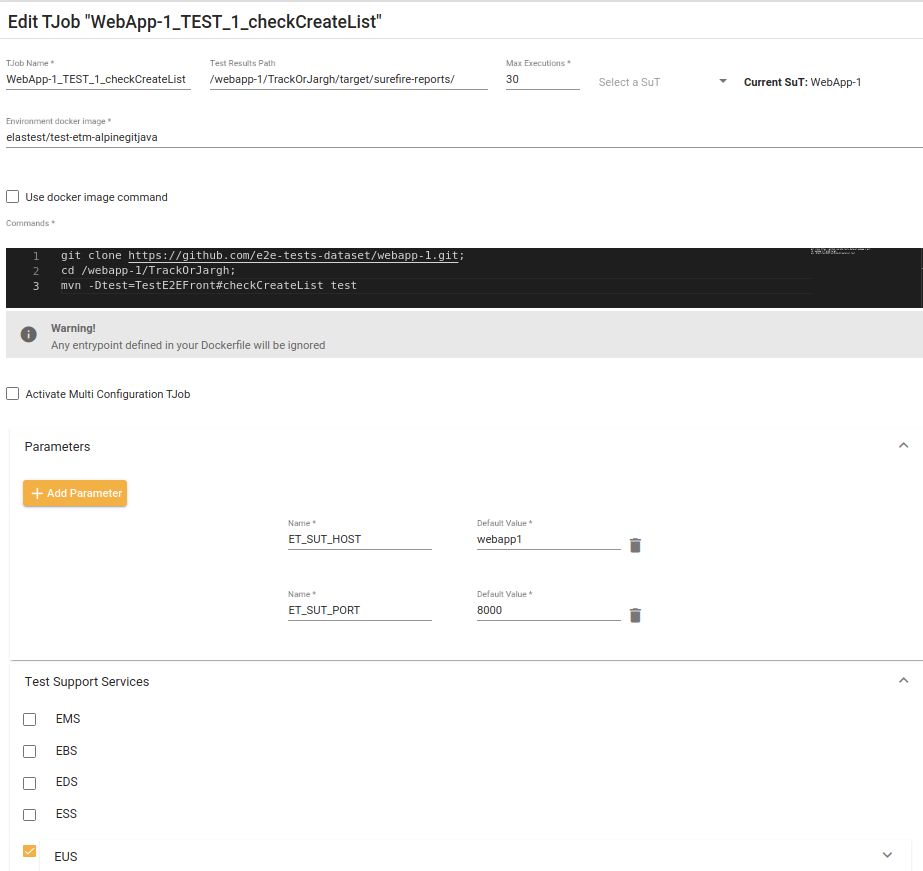

# Reproduce E2E-DATASET results for the experiment

## Step 1: Install Docker and Elastest

- [Install Docker](https://docs.docker.com/get-docker/)
- Install ElastestFollow (See [official documentation](https://elastest.io/docs/tutorials/getting-started/))


```
    docker run --rm -v ~/.elastest:/data -v /var/run/docker.sock:/var/run/docker.sock elastest/platform start
```

## Step 2: Set up Project

- Open http://localhost:37000 in your browser
- Create new project (i.e. E2ETEST-QUATIC)


## Step 3: Set up all SuT

- Inside this project, create a new SuT (Software under Test) for each project (WebApp-1, WebApp-2 and WebApp-3):
  - Set `SutName` to **WebApp-N**
  - Set `Deployed by ElasTest` option
  - Set `With Docker Compose` option
  - Fill `Docker Compose` textarea with properly docker-compose [(see docker-compose/ folder)](docker-compose/webapp-1.yml)
  - Set `Main Service name` to  **webapp-N**
  - Set `protocol` to **http** and `port` to **8000**

> **Example of SuT:**
> 
> 
>

  
## Step 4: Set up all TJobs

Inside this project, create a new TJob for each test.

- For test `checkCreateList` of `WebApp-1`
  
  - TJobName: `WebApp-1_TEST_1_checkCreateList`
  - Test Result Path: `/webapp-1/TrackOrJargh/target/surefire-reports/`
  - Current SuT: `WebApp-1`
  - Enviroment docker image: `elastest/test-etm-alpinegitjava`
  - Commands:
    ```
        git clone https://github.com/e2e-tests-dataset/webapp-1.git; 
        cd /webapp-1/TrackOrJargh; 
        mvn -Dtest=TestE2EFront#checkCreateList test
    ```
  - Add parameters:
    - `ET_SUT_HOST`: **webapp1**
    - `ET_SUT_PORT`: **8000**
  - Add Test Support Services:
    - Select `EUS` (this services manage the browsers needed for the test)

- For test `checkCreateCourse` of `WebApp-2`
  
  - TJobName: `WebApp-2_TEST_1_checkCreateCourse`
  - Test Result Path: `/webapp-2/AMICOServer/target/surefire-reports/`
  - Current SuT: `WebApp-2`
  - Enviroment docker image: `elastest/test-etm-alpinegitjava`
  - Commands:
    ```
        git clone https://github.com/e2e-tests-dataset/webapp-2.git;
        cd /webapp-2/AMICOServer; 
        mvn -Dtest=TestE2EFront#checkCreateCourse test;
    ```
  - Add parameters:
    - `ET_SUT_HOST`: **webapp2**
    - `ET_SUT_PORT`: **8000**
  - Add Test Support Services:
    - Select `EUS` (this services manage the browsers needed for the test)

- For test `checkDownload` of `WebApp-2`
  
  - TJobName: `WebApp-2_TEST_2_checkDownload`
  - Test Result Path: `/webapp-2/AMICOServer/target/surefire-reports/`
  - Current SuT: `WebApp-2`
  - Enviroment docker image: `elastest/test-etm-alpinegitjava`
  - Commands:
    ```
        git clone https://github.com/e2e-tests-dataset/webapp-2.git;
        cd /webapp-2/AMICOServer; 
        mvn -Dtest=TestE2EFront#checkDownload test;
    ```
  - Add parameters:
    - `ET_SUT_HOST`: **webapp2**
    - `ET_SUT_PORT`: **8000**
  - Add Test Support Services:
    - Select `EUS` (this services manage the browsers needed for the test)

- For test `checkShowProfile` of `WebApp-2`
  
  - TJobName: `WebApp-2_TEST_3_checkShowProfile`
  - Test Result Path: `/webapp-2/AMICOServer/target/surefire-reports/`
  - Current SuT: `WebApp-2`
  - Enviroment docker image: `elastest/test-etm-alpinegitjava`
  - Commands:
    ```
        git clone https://github.com/e2e-tests-dataset/webapp-2.git;
        cd /webapp-2/AMICOServer; 
        mvn -Dtest=TestE2EFront#checkShowProfile test;
    ```
  - Add parameters:
    - `ET_SUT_HOST`: **webapp2**
    - `ET_SUT_PORT`: **8000**
  - Add Test Support Services:
    - Select `EUS` (this services manage the browsers needed for the test)

- For test `checkShowAdminPage` of `WebApp-3`
  
  - TJobName: `WebApp-3_TEST_1_checkShowAdminPage`
  - Test Result Path: `/webapp-3/BREMS/target/surefire-reports/`
  - Current SuT: `WebApp-3`
  - Enviroment docker image: `elastest/test-etm-alpinegitjava`
  - Commands:
    ```
        git clone https://github.com/e2e-tests-dataset/webapp-3.git;
        cd /webapp-3/BREMS; 
        mvn -Dtest=TestE2EFront#checkShowAdminPage test
    ```
  - Add parameters:
    - `ET_SUT_HOST`: **webapp3**
    - `ET_SUT_PORT`: **8000**
  - Add Test Support Services:
    - Select `EUS` (this services manage the browsers needed for the test)

> **Example of TJob:**
> 
> 


## Step 5: Run all TJobs

- Run each TJob 10 times (Play buttom)
- Do not run them concurrently
- Each time you run a TJob, a TJobExecution will be created


## Step 6: Collect Results

- Click on TJob to see all TJobExecutions of it
- Click on TJobExecution to see the results
- Download the results using "_Download as JSON_" (at top-right corner of TJobExecution panel)
- Store the this Json properly at `ComparativeTool/results/<project>/<test_name>/<tjob_name>-execution_XXX.json`
  - For example: `ComparativeTool/results/WebApp-1/checkCreateList/TJob_WebApp-1_TEST_1_checkCreateList-execution_291.json`